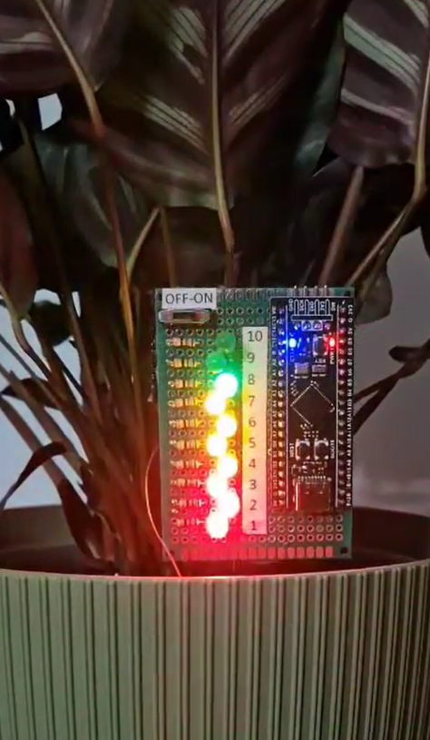

# Soil Moisture Sensor
>The project, with the working name "Soil moisture sensor v1", was made by special order for my wife, who started the adventure with flowers in our house and did not know when to water them.
>So with the stuff I had at home in two afternoons I made it, and she and our flowers are now very happy.

>>Now this project is being developed in another repository. -> https://github.com/grados73/akwa_elektron

## Table of contents
* [General info](#general-info)
* [Screenshots](#screenshots)
* [Technologies](#technologies)
* [HARDWARE](#hardware)
* [Features](#features)
* [Status](#status)
* [Inspiration](#inspiration)
* [Contact](#contact)

## General info
It is very simply project using STM32F411 BlackPill and the battery and charger from my colleague's electronic cigarette (with his permission :))

## Screenshots

## Technologies
Project is created with:
* C,
* HAL for STM32F4,
* STM32CubeIDE,

## HARDWARE
* Blackpill STM32F411CEU6 
* Gravity: Analog Capacitive Soil Moisture Sensor

## Features
* Display of the measured value in levels (from 1 to 10) on LED
* Measurement frequency display
* Charging via micro usb

## To-do list
* Measuring supply voltage

## Status
If my wife gives it to me for a while, I will add checking the power level through a voltage divider.
I have an idea to create a second version of the device with an e-paper display and a microcontroller that will wake up from deep sleep, 
take regular measurements and refresh the display, which may include the time of the last watering, etc. Maybe with a photovoltaic panel and a humidity sensor....

## Inspiration
It will be added.

## Contact
Created by https://www.linkedin.com/in/kamil-gradowski-8706991aa - feel free to contact me!
grados73
